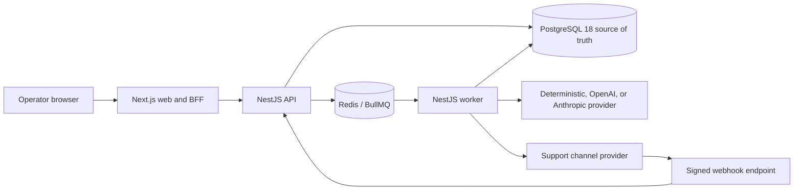

# Autonomous CSA

A production-oriented agentic customer-support platform using a Router, Retriever, Resolver, and Critic pipeline, persistent execution state, tool-driven workflows, guardrails, human approval, and reliable asynchronous delivery.

**Status:** v1.0 release candidate; feature-complete portfolio-grade MVP; locally production-validated. Production deployment is not claimed, and hosted staging is deferred under a strict zero-spend policy.

## Capabilities

- Multi-tenant organizations with first-party authentication, rotating refresh sessions, HttpOnly cookies, and OWNER/ADMIN/AGENT/VIEWER RBAC.
- Ticket, message, timeline, agent-run, step, knowledge-retrieval, guardrail, approval, and draft lifecycles.
- Router, Retriever, Resolver, and Critic orchestration with OpenAI/Anthropic abstractions and deterministic local fallback.
- Signed inbound channel webhooks, durable idempotency, conversation threading, customer matching, and attachment metadata sanitization.
- Transactional outbound delivery with bounded retries, delivery callbacks, dead-letter visibility, and authorized replay.
- Structured logging, correlation IDs, Prometheus metrics, health/readiness, distributed rate limiting, backup/restore, and failure drills.

## Architecture



The system is agentic because it performs a persisted, multi-stage decision workflow: Router classifies and chooses a path, Retriever gathers tenant-scoped knowledge, Resolver constructs a proposed action, and Critic evaluates it before guardrails and approval policy determine whether a draft can proceed. Agent runs, steps, tool results, costs, failures, and human decisions are durable. Python is not required for those properties; TypeScript is the orchestration runtime.

## Reliable Channel Flow

Inbound raw bytes are HMAC-verified before parsing. A unique webhook receipt suppresses replays, then the API resolves the connection's organization, matches the external customer and conversation, persists the inbound message and ticket, and dispatches a job. Outbound approval creates one durable message record; the worker claims it, records delivery attempts, retries transient failures within a bound, dead-letters permanent failures, and applies idempotent delivery callbacks.

## Stack

Next.js 16, React 19, NestJS 11, TypeScript, Prisma 6, PostgreSQL 18, Redis 7, BullMQ 5, pnpm workspaces, Turborepo, Docker Compose, Jest, GitHub Actions, CodeQL, Gitleaks, Semgrep, and Trivy.

## Quick Start

Prerequisites: Node.js 22, pnpm 10.29.1, and Docker Desktop.

```powershell
pnpm.cmd install --frozen-lockfile
docker compose up -d
pnpm.cmd db:migrate:deploy
pnpm.cmd db:seed
pnpm.cmd dev
```

The development seed creates `demo.owner@example.com`; its local-only password is documented in the seed and must never be reused outside development.

## One-Command Demo

```powershell
pnpm.cmd demo:up
```

This builds production API/worker/web images, starts PostgreSQL 18 and Redis, applies all migrations, seeds deterministic users/data, verifies readiness and RBAC, executes a signed inbound channel workflow through agent draft approval and mock delivery, exercises retry/dead-letter/replay and restart drills, and verifies backup/restore. Generated credentials remain under ignored `run-output/` and are not printed.

```powershell
pnpm.cmd demo:verify
pnpm.cmd demo:down
pnpm.cmd demo:reset
```

## Verified Results

Final local validation on June 17, 2026 passed 212 automated tests (90 API, 91 worker, 7 web, 24 script utilities), lint, typecheck, build, Prisma validation, 13 fresh/idempotent migrations, all three production Docker image builds, PostgreSQL 18.4 backup/restore, and Redis/BullMQ compatibility. The final bounded mock-channel drill issued 20 local requests at concurrency 5: p50 75 ms, p95 329 ms, p99 364 ms, 0% request errors, and 9 duplicate deliveries suppressed. These are local verification measurements, not production capacity or an SLA.

## Repository

- `apps/web`: operator UI and same-origin API proxy.
- `apps/api`: authenticated REST API, tenancy, webhooks, operations, and queue producers.
- `apps/worker`: agent pipeline and transactional delivery consumers.
- `packages/db`: Prisma schema, migrations, seed, and database helpers.
- `packages/observability`: runtime validation, logging, redaction, metrics, and correlation.
- `scripts`: demo, staging, channel, load, backup, and restore verification.
- `docs`: architecture, security, operations, runbooks, release, and portfolio material.

Start with the [documentation index](docs/README.md), [architecture](docs/ARCHITECTURE.md), [final overview](docs/FINAL_SYSTEM_OVERVIEW.md), [security audit](docs/FINAL_SECURITY_AUDIT.md), and [validation report](docs/FINAL_VALIDATION_REPORT.md).

## Limitations

No production or persistent hosted staging deployment exists. The mock email provider proves the channel contract without external delivery. Real Gmail/Zendesk adapters, SSO, invitations, billing, object storage for attachment bytes, managed secrets, multi-region failover, and production-scale load testing remain outside v1.0. See [known limitations](docs/KNOWN_LIMITATIONS.md).

Fly.io manifests are retained as an opt-in deployment foundation, but the default workflow cannot deploy and no billing will be attached. Hosted staging is deferred under the zero-spend policy.

## License

UNLICENSED. This repository is provided as a portfolio project; no open-source license grant is made.
