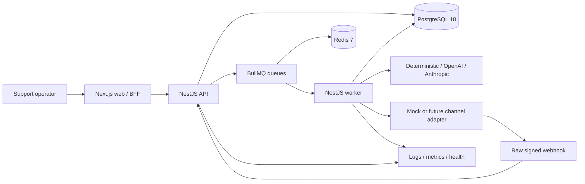
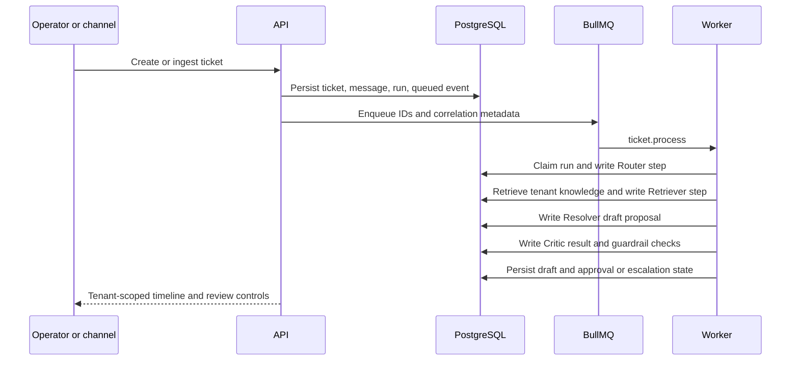
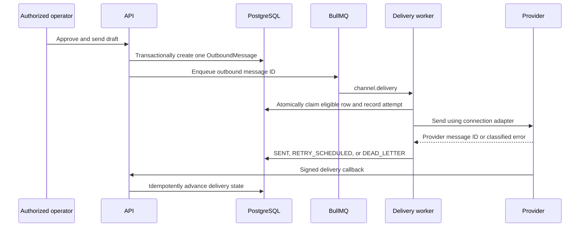
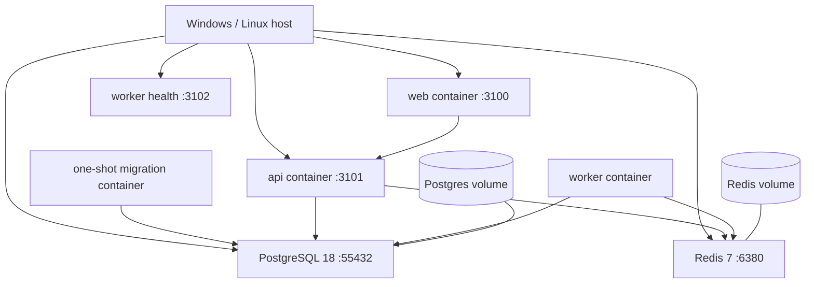

# Architecture

Autonomous CSA is a TypeScript monorepo with a Next.js operator console, a NestJS control-plane API, a NestJS asynchronous worker, PostgreSQL as the system of record, and Redis/BullMQ as bounded delivery infrastructure.

## High-Level System



PostgreSQL owns business truth, idempotency records, queue-recovery state, and audit history. Redis is not authoritative application storage.

## Ticket And Agent Processing



The queue payload contains identifiers, not provider secrets or customer message bodies. The worker reloads authoritative records under the job's organization ID.

## Inbound Support Channel

```mermaid
sequenceDiagram
  participant P as Provider
  participant A as API webhook
  participant D as PostgreSQL
  participant Q as BullMQ
  participant W as Worker
  P->>A: Raw bytes + connection public ID + HMAC
  A->>D: Resolve enabled connection and organization
  A->>A: Timing-safe signature and payload-limit checks
  A->>D: Insert unique WebhookReceipt
  A->>D: Match customer/conversation; persist message and dispatch
  A->>Q: Enqueue ticket ID, run ID, organization ID
  A-->>P: Accepted or duplicate-safe response
  Q->>W: Process agent run
  W->>D: Draft, guardrails, approval
```

Unknown or disabled connections fail before business writes. The payload cannot select an organization or ticket. A durable inbound-dispatch reconciler recovers an accepted database transaction if Redis is temporarily unavailable.

## Outbound Transactional Delivery



Successful sends are not retried. Transient failures have bounded exponential backoff; permanent failures dead-letter immediately. Reconciliation recovers pending, retryable, or stale-processing rows.

## Authentication And Tenant Context

```mermaid
sequenceDiagram
  participant B as Browser
  participant W as Next.js BFF
  participant A as NestJS API
  participant D as PostgreSQL
  B->>W: Login credentials
  W->>A: POST /auth/login
  A->>D: Verify Argon2id hash; create hashed refresh session
  A-->>W: Access token, refresh token, memberships
  W-->>B: HttpOnly cookies
  B->>W: Tenant-scoped request
  W->>A: Bearer token + selected organization header
  A->>D: Verify active user and membership
  A->>A: TenantContextGuard and RolesGuard
  A->>D: Query with verified organization ID
```

The organization header selects among memberships; it is never trusted by itself. Refresh tokens rotate, old sessions are revoked, and logout revokes the presented session.

## Local Production-Like Topology



The demo generates local secrets into ignored `run-output/staging-local.env`, builds the same non-root production images used by CI, runs migrations before applications, and uses the deterministic AI and mock channel providers. Hosted Fly manifests exist only as a future opt-in foundation.

## Ownership And Failure Model

- API controllers validate transport input and delegate to tenant-aware services.
- Composite uniqueness, organization-scoped lookups, guards, and service predicates enforce isolation.
- Database transactions couple approval/outbox state and inbound receipt/message state.
- BullMQ provides delivery, delay, retry, stalled-job detection, and bounded retention.
- Readiness checks PostgreSQL, Redis, configuration, and shutdown state; liveness intentionally remains shallow.
- Correlation IDs connect HTTP, job, run, step, audit, and failure records.
- Backup tooling requires compatible PostgreSQL clients, checksum verification, redacted metadata, and restore into an isolated database.
