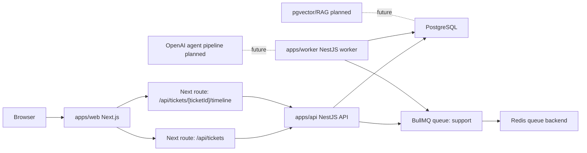
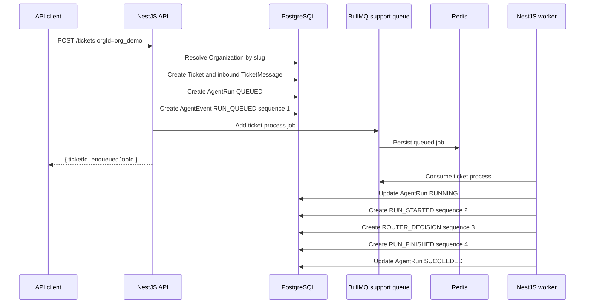
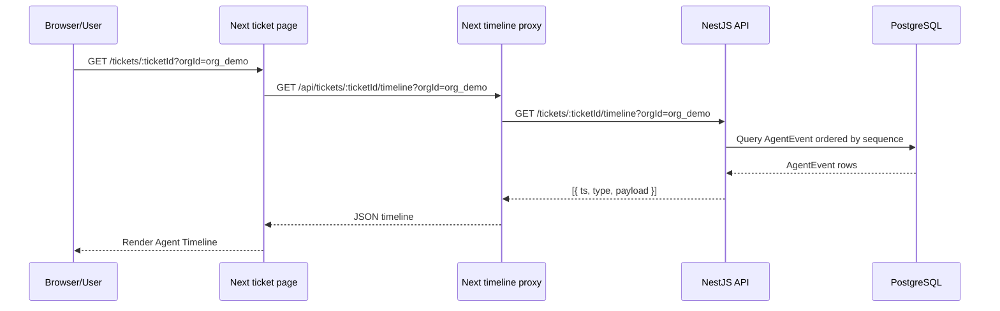

# Architecture

This monorepo is a Phase 1 foundation for an Agentic AI Customer Support SaaS. The current system uses Next.js, NestJS API, NestJS worker, BullMQ, Redis, PostgreSQL, and Prisma. Redis is now queue infrastructure only. PostgreSQL is the source of truth for tickets, ticket messages, agent runs, and agent timeline events.

Auth, enforced multi-tenancy, OpenAI agents, RAG, pgvector embeddings, deployment, and CI/CD are still future phases.

## Current Applications

| Path | Role | Current status |
| --- | --- | --- |
| `apps/web` | Next.js App Router UI | Ticket timeline page, minimal ticket inbox page, and Next proxy routes for tickets/timeline. |
| `apps/api` | NestJS REST API | Health, ticket create/list/detail, timeline endpoint, Swagger, BullMQ enqueue, Prisma persistence. |
| `apps/worker` | NestJS worker | Consumes BullMQ `ticket.process`, updates `AgentRun`, and writes `AgentEvent` rows. |
| `packages/db` | Shared database package | Prisma schema, migration, seed, generated-client export surface. |
| `packages/config` | Future shared config package | Placeholder. |
| `packages/shared` | Future shared domain/types package | Placeholder. |
| `infra` | Future infrastructure definitions | Placeholder. |

## Service Architecture

## Ticket Processing Sequence

## Timeline Flow

## Database

Prisma lives in `packages/db`.

Implemented models:

- `Organization`
- `Ticket`
- `TicketMessage`
- `AgentRun`
- `AgentEvent`

Implemented enums:

- `TicketStatus`
- `TicketPriority`
- `MessageDirection`
- `AgentRunStatus`
- `AgentRunTrigger`
- `AgentEventType`

The first migration is in `packages/db/prisma/migrations/20260613201721_init`.

## Temporary Tenant Handling

The API still accepts `orgId: "org_demo"` for compatibility with Phase 0 requests. In Phase 1, that request value is treated as an organization slug, not the database primary key. The API resolves `Organization.slug = "org_demo"` and then uses the real `Organization.id` internally for tickets, messages, runs, and events.

This is not production multi-tenancy. Auth and tenant enforcement remain future work.

