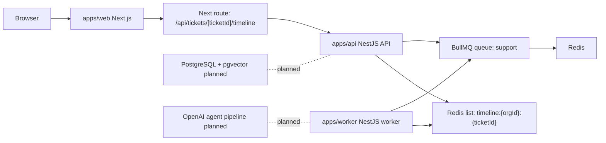
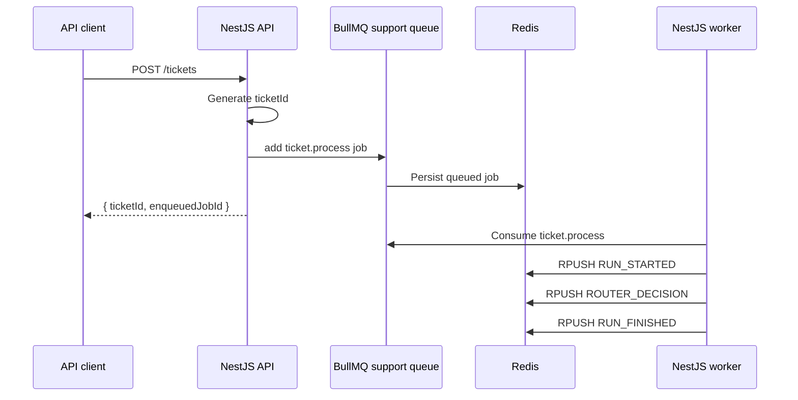
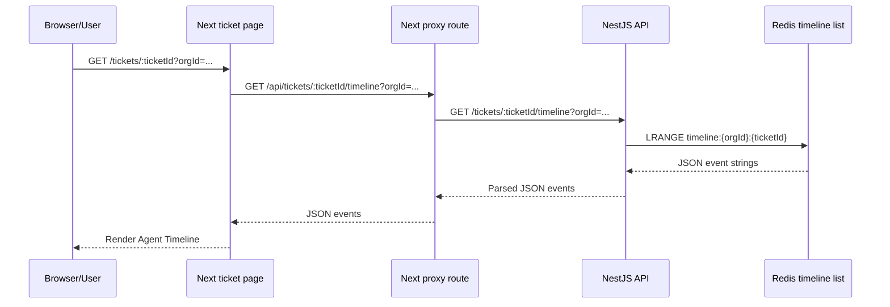

# Architecture

This repository is an early monorepo for an Agentic AI Customer Support SaaS. The current implementation proves a small async ticket-processing path with a Next.js UI, a NestJS API, a NestJS worker, BullMQ, and Redis. PostgreSQL, pgvector, authentication, multi-tenancy enforcement, knowledge retrieval, OpenAI agents, CI/CD, and Fly.io deployment are planned but not implemented yet.

## Current Applications

| Path | Role | Current status |
| --- | --- | --- |
| `apps/web` | Next.js App Router web UI | Ticket timeline page and API proxy route exist under `[ticketId]` and use the matching `params.ticketId` value. |
| `apps/api` | NestJS REST API | Health endpoint, ticket creation endpoint, timeline endpoint, BullMQ queue registration, and Swagger setup exist. Ticket persistence and DTO validation are not implemented. |
| `apps/worker` | NestJS worker process | BullMQ processor consumes `support` jobs and writes stub timeline events to Redis. |
| `packages/config` | Shared configuration package | Directory exists but has no package files or implementation. |
| `packages/shared` | Shared domain/types package | Directory exists but has no package files or implementation. |
| `infra` | Infrastructure definitions | Directory exists but is empty. |

## Current Service Architecture

## Ticket Processing Sequence

## Current Timeline Flow

The Next folders are named `[ticketId]`, and both the proxy route and ticket page read the matching `params.ticketId` value.

## Current Implementation Details

- `apps/api/src/main.ts` creates Swagger docs at `/docs` and listens on `PORT` or `3001`.
- `apps/api/src/health.controller.ts` exposes `GET /health`.
- `apps/api/src/queue/queue.module.ts` configures BullMQ with `REDIS_HOST` and `REDIS_PORT`, defaulting to `localhost:6379`.
- `apps/api/src/tickets/tickets.controller.ts` exposes `POST /tickets`, generates a UUID, and enqueues `ticket.process`.
- `apps/api/src/tickets/tickets.timeline.controller.ts` exposes `GET /tickets/:id/timeline?orgId=...` and reads Redis list events.
- `apps/worker/src/app.module.ts` registers the same BullMQ `support` queue.
- `apps/worker/src/support.processor.ts` handles `ticket.process` and writes three timeline events.
- `apps/worker/src/timeline.ts` stores timeline events in Redis under `timeline:{orgId}:{ticketId}`, capped at the last 200 events.
- `apps/web/src/app/api/tickets/[ticketId]/timeline/route.ts` proxies timeline requests to the API using `API_BASE_URL` or `http://localhost:3001`.
- `apps/web/src/app/tickets/[ticketId]/page.tsx` fetches the proxy route server-side and renders timeline events.

## Planned Architecture

The intended production architecture should add:

- PostgreSQL for tenants, users, tickets, messages, agent runs, and audit events.
- pgvector for embeddings and semantic knowledge retrieval.
- Durable `agent_events` or equivalent audit timeline table.
- Authentication and tenant-aware authorization middleware.
- OpenAI agent pipeline with routing, retrieval, drafting, tool calls, and human approval.
- Worker jobs for ticket classification, RAG retrieval, draft generation, and escalation workflows.
- Docker images for web, API, and worker.
- CI/CD with lint, typecheck, test, build, image publishing, migrations, and deployment checks.
- Fly.io or equivalent deployment manifests for web/API/worker/Redis/Postgres connectivity.
