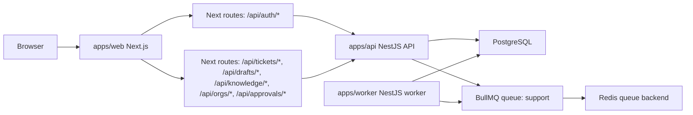
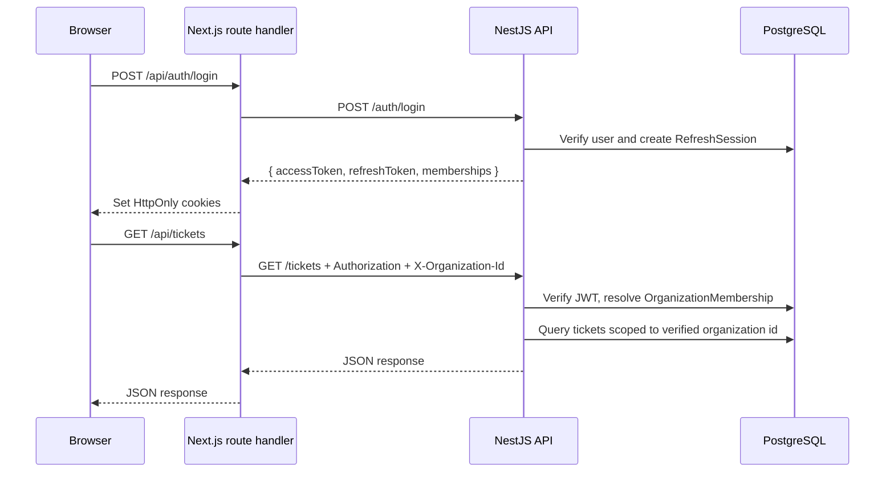
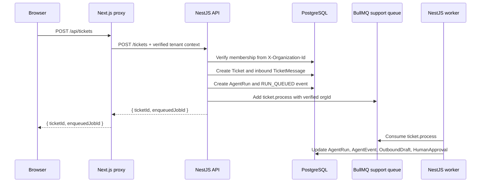

# Architecture

This monorepo now implements the Phase 8 authenticated multi-tenant architecture for Autonomous CSA. The current system uses Next.js, NestJS API, NestJS worker, BullMQ, Redis, PostgreSQL, and Prisma. Redis remains queue infrastructure only. PostgreSQL is the source of truth for tickets, messages, runs, events, users, memberships, refresh sessions, approvals, drafts, and organization settings.

## Current Applications

| Path | Role | Current status |
| --- | --- | --- |
| `apps/web` | Next.js App Router UI | Auth pages, protected app shell, organization switcher, and tenant-aware proxy routes. |
| `apps/api` | NestJS REST API | Auth endpoints, JWT access guard, tenant context guard, RBAC, Swagger, BullMQ enqueue, Prisma persistence. |
| `apps/worker` | NestJS worker | Consumes `ticket.process`, runs the support pipeline, applies guardrails, and writes events/drafts/approvals. |
| `packages/db` | Shared database package | Prisma schema, migrations, seed, and generated client exports. |
| `infra` | Future infrastructure definitions | Placeholder. |

## Service Architecture

## Authenticated Request Flow

## Ticket Processing Sequence

## Tenant Enforcement Model

- The browser does not pick an authoritative tenant from query parameters.
- The selected organization id is stored in `au_organization_id`.
- Next.js forwards `X-Organization-Id` to the API.
- `TenantContextGuard` resolves the authenticated user's `OrganizationMembership`.
- Services still query by verified `orgId` to preserve defense in depth.

## Database

Prisma lives in `packages/db`.

Phase 8 auth and tenancy additions:

- Models:
  `User`,
  `OrganizationMembership`,
  `RefreshSession`
- Enums:
  `OrganizationRole`,
  `ActorType`
- Audit attribution fields:
  `HumanApproval.reviewedByUserId`,
  `OutboundDraft.createdByType`,
  `OutboundDraft.createdByUserId`,
  `OutboundDraft.approvedByType`,
  `OutboundDraft.approvedByUserId`,
  `OutboundDraft.sentBy`,
  `OutboundDraft.sentByType`,
  `OutboundDraft.sentByUserId`

Phase 8 migration:

- `packages/db/prisma/migrations/20260614130000_phase8_auth_tenancy`

## Security Boundary

Phase 8 closes the earlier authorization gap where callers could supply arbitrary organization identifiers.

- Request-provided org identifiers are no longer authoritative.
- Auth is first-party and API-controlled.
- Access tokens are short-lived.
- Refresh tokens rotate and are stored hashed in Postgres.
- Human actions now record real user ids.
## Phase 9 additions

- `packages/observability`: shared logging, correlation, redaction, error serialization, metric names, and timing helpers
- API observability module: request logging, exception filter, metrics, readiness
- Worker observability module: HTTP health/metrics plus structured processor logging
- Operations module: tenant-scoped runs, failures, replay, resolve, audit search, and CSV export
